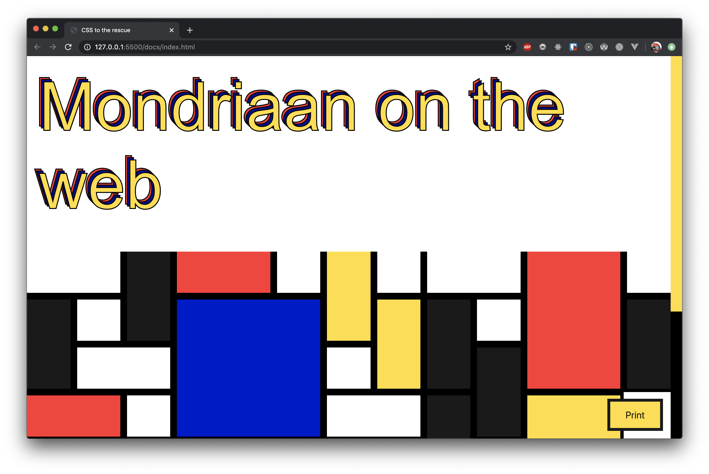

# CSS to the rescue
> Using only CSS so users can create their own Mondriaan 'painting' and print it out.



## Installation
```bash
# Clone the repo
git clone https://github.com/kriskuiper/css-to-the-rescue-1920.git

# Install dependencies
yarn / npm install

# Run a local dev server on port 7071
yarn dev / npm run dev
```

## Features
Users can click blocks to change their aspect ratio and create their own Mondriaan that way. Clicking the print button or using `cmd / ctrl + p` will print only the users' creation.

## Contexts in mind while building this project
During building this project I've kept the following contexts in mind:
- Remove animations and transitions when user prefers reduced motion
- Make the art printable using a print stylesheet or a `@media print` media query.

## Contraints while building this project
During this project I tried to implement the following constraints:
- Make the website responsive without using media queries
- Try to make it Mondriaan style as much as possible, this means using only square shapes.

## Project wishlist
- [ ] Make the layout fit on one page
- [ ] Use some kind of dark mode or look at the users' settings to make a 'dark moded Mondriaan' but print it as if it is light mode

## My process and experiments
At first I started out with an e-commerce concept which is displayed below:


With this concept I found out that I was just focussing too much on the concept itself rather than experimenting with CSS as much as I would or could do in these three weeks.

However, things I've learned building this concept were:
- You can use `clip-path()`

## What I've learned this course

